# 1Secure to DRIVE Maturity Level Mapping

## Overview

This document explains how Netwrix 1Secure's existing risk threshold model maps to the DRIVE maturity level blocking architecture.

---

## 1Secure Risk Threshold Model (Current)

### Three Threshold Types

**1. Boolean (Binary)**
- **Input:** True/False condition detection
- **Output:** Single severity level
- **Example:** "Third-Party Applications Allowed" → If TRUE, then HIGH risk

**2. Percentage (%)**
- **Input:** Percentage value (0-100%)
- **Output:** Low/Medium/High based on threshold bands
- **Example:** "High Risk Permissions on Documents"
  - <5% → Low
  - 5-15% → Medium
  - ≥15% → High

**3. Numerical (Count)**
- **Input:** Numeric count value
- **Output:** Low/Medium/High based on threshold bands
- **Example:** "Stale User Accounts"
  - <10 accounts → Low
  - 10-50 accounts → Medium
  - >50 accounts → High

### 1Secure Severity Assignment

```
┌─────────────────────────────────────────────────────────────┐
│                    1Secure Risk Engine                       │
├─────────────────────────────────────────────────────────────┤
│                                                               │
│  Input: Risk Detection                                       │
│    ├─ Boolean: True/False                                    │
│    ├─ Percentage: 0-100%                                     │
│    └─ Numerical: Count value                                 │
│                                                               │
│  Threshold Evaluation                                        │
│    ├─ Compare against High threshold                         │
│    ├─ Compare against Medium threshold                       │
│    └─ Compare against Low threshold                          │
│                                                               │
│  Output: Severity Assignment                                 │
│    ├─ HIGH (above High threshold)                            │
│    ├─ MEDIUM (between Medium-High thresholds)                │
│    └─ LOW (between Low-Medium thresholds)                    │
│                                                               │
└─────────────────────────────────────────────────────────────┘
```

---

## DRIVE Maturity Blocking Model (New)

### Severity to Level Blocking Mapping

```mermaid
graph TB
    subgraph "1Secure Risk Detection"
        A[Risk Check Execution]
        A --> B{Threshold Type?}

        B -->|Boolean| C[True/False]
        B -->|Percentage| D[0-100%]
        B -->|Numerical| E[Count Value]

        C --> F[Single Severity]
        D --> G[Threshold Bands]
        E --> G

        G --> H{Compare Thresholds}
        H -->|≥ High Threshold| I[HIGH]
        H -->|Medium-High Range| J[MEDIUM]
        H -->|Low-Medium Range| K[LOW]
        F --> I
    end

    subgraph "DRIVE Maturity Blocking"
        I --> L[Blocks Level 1]
        J --> M[Blocks Level 2]
        K --> N[Blocks Level 3]

        L --> O[Cannot advance to Level 2+]
        M --> P[Cannot advance to Level 3+]
        N --> Q[Cannot advance to Level 4+]
    end

    subgraph "Organization Maturity Level"
        O --> R[Stuck at Level 1]
        P --> S[Stuck at Level 2]
        Q --> T[Stuck at Level 3]

        R --> U[Must remediate HIGH risks]
        S --> V[Must remediate MEDIUM risks]
        T --> W[Must remediate LOW risks]
    end

    style I fill:#ff6b6b
    style J fill:#ffa500
    style K fill:#ffd93d
    style L fill:#ff6b6b
    style M fill:#ffa500
    style N fill:#ffd93d
    style R fill:#ff6b6b
    style S fill:#ffa500
    style T fill:#ffd93d
```



---

## Detailed Mapping Examples

### Example 1: High Risk Permissions (Percentage-based)

```mermaid
graph LR
    subgraph "1Secure Detection"
        A[Scan SharePoint] --> B[Count Documents with<br/>High Risk Permissions]
        B --> C[Calculate Percentage]
    end

    subgraph "1Secure Threshold Evaluation"
        C --> D{Percentage Value}
        D -->|"< 5%"| E[LOW Severity]
        D -->|"5% - 15%"| F[MEDIUM Severity]
        D -->|"≥ 15%"| G[HIGH Severity]
    end

    subgraph "DRIVE Maturity Blocking"
        E --> H[Blocks Level 3]
        F --> I[Blocks Level 2]
        G --> J[Blocks Level 1]
    end

    subgraph "Maturity Outcome"
        H --> K[Organization can be<br/>Level 1 or 2]
        I --> L[Organization can be<br/>Level 1 only]
        J --> M[Organization stuck<br/>at Level 0/1]
    end

    style E fill:#ffd93d
    style F fill:#ffa500
    style G fill:#ff6b6b
    style H fill:#ffd93d
    style I fill:#ffa500
    style J fill:#ff6b6b
```



**Real-world scenario:**
- **Organization A:** 3% high-risk permissions → LOW → Blocks Level 3 → Can achieve Level 1-2
- **Organization B:** 12% high-risk permissions → MEDIUM → Blocks Level 2 → Stuck at Level 1
- **Organization C:** 20% high-risk permissions → HIGH → Blocks Level 1 → Stuck at Level 0

---

### Example 2: Third-Party Applications (Boolean)


**Real-world scenario:**
- **Organization A:** Third-party apps enabled → HIGH → Blocks Level 2 → Must disable to advance
- **Organization B:** Third-party apps disabled → No risk → Passes check → Can advance

---

### Example 3: Stale User Accounts (Numerical Count)


**Real-world scenario:**
- **Organization A:** 5 stale accounts → LOW → Blocks Level 3 → Can achieve Level 1-2
- **Organization B:** 25 stale accounts → MEDIUM → Blocks Level 2 → Stuck at Level 1
- **Organization C:** 75 stale accounts → HIGH → Blocks Level 1 → Stuck at Level 0

---

## Complete Threshold Mapping Architecture

```mermaid
flowchart TD
    Start[1Secure Risk Scan] --> Detect[Detect Risk Condition]

    Detect --> Type{Threshold Type?}

    Type -->|Boolean| Bool[Binary Detection]
    Type -->|Percentage| Pct[Percentage Calculation]
    Type -->|Numerical| Num[Count Calculation]

    Bool --> BoolEval{Condition Met?}
    BoolEval -->|True| SevHigh[HIGH Severity]
    BoolEval -->|False| Pass[✓ Pass - No Risk]

    Pct --> PctEval{Compare %<br/>to Thresholds}
    PctEval -->|"≥ High Threshold"| SevHigh
    PctEval -->|"Medium-High Range"| SevMed[MEDIUM Severity]
    PctEval -->|"Low-Medium Range"| SevLow[LOW Severity]
    PctEval -->|"< Low Threshold"| Pass

    Num --> NumEval{Compare Count<br/>to Thresholds}
    NumEval -->|"≥ High Threshold"| SevHigh
    NumEval -->|"Medium-High Range"| SevMed
    NumEval -->|"Low-Medium Range"| SevLow
    NumEval -->|"< Low Threshold"| Pass

    SevHigh --> Block1[🚫 Blocks Level 1]
    SevMed --> Block2[🚫 Blocks Level 2]
    SevLow --> Block3[🚫 Blocks Level 3]
    Pass --> NoBlock[✓ No Blocking]

    Block1 --> Outcome1[Organization cannot<br/>advance past Level 1]
    Block2 --> Outcome2[Organization cannot<br/>advance past Level 2]
    Block3 --> Outcome3[Organization cannot<br/>advance past Level 3]
    NoBlock --> Outcome4[Check passes,<br/>maturity determined<br/>by other checks]

    Outcome1 --> Remediate1[Must remediate to<br/>below HIGH threshold]
    Outcome2 --> Remediate2[Must remediate to<br/>below MEDIUM threshold]
    Outcome3 --> Remediate3[Must remediate to<br/>below LOW threshold]

    Remediate1 --> Rescan[Re-scan with 1Secure]
    Remediate2 --> Rescan
    Remediate3 --> Rescan
    Outcome4 --> Rescan

    Rescan --> ReEval{Risk Level<br/>Changed?}
    ReEval -->|Yes| Advance[✓ Can advance to<br/>next maturity level]
    ReEval -->|No| StillBlocked[Still blocked at<br/>current level]

    style SevHigh fill:#ff6b6b,color:#fff
    style SevMed fill:#ffa500,color:#fff
    style SevLow fill:#ffd93d,color:#000
    style Pass fill:#95e1d3,color:#000
    style Block1 fill:#ff6b6b,color:#fff
    style Block2 fill:#ffa500,color:#fff
    style Block3 fill:#ffd93d,color:#000
    style NoBlock fill:#95e1d3,color:#000
```



---

## Mapping Table

### Severity to Maturity Level Blocking

| 1Secure Severity | DRIVE Blocks Level | Cannot Advance Past | Must Achieve | Example Condition |
|------------------|-------------------|---------------------|--------------|-------------------|
| **HIGH** | Level 1 | Level 1 | Level 0-1 | ≥15% high-risk permissions |
| **MEDIUM** | Level 2 | Level 2 | Level 1-2 | 5-15% high-risk permissions |
| **LOW** | Level 3 | Level 3 | Level 1-3 | <5% high-risk permissions |
| **PASS** | None | None | Any level | <1% high-risk permissions |

### Threshold Type Examples

| Risk Check | Threshold Type | Low Threshold | Medium Threshold | High Threshold | Units |
|-----------|---------------|---------------|------------------|----------------|-------|
| High Risk Permissions | Percentage | <5% | 5-15% | ≥15% | % of documents |
| External Sharing | Percentage | <3% | 3-10% | ≥10% | % of files shared |
| Stale Accounts | Numerical | <10 | 10-50 | >50 | Account count |
| Anonymous Links | Percentage | <1% | 1-5% | ≥5% | % of links |
| Third-Party Apps | Boolean | N/A | N/A | Enabled | True/False |
| Privileged Users | Numerical | <5 | 5-20 | >20 | User count |

---

## Binary Advancement Logic

### Organization Maturity Calculation


### Algorithm

```python
def calculate_maturity_level(organization):
    """
    Calculate organization maturity level based on 1Secure risk findings.
    Binary advancement: must pass ALL checks at each level to advance.
    """

    # Run all 1Secure checks
    check_results = run_1secure_scan(organization)

    # Track minimum (worst) blocking level
    min_blocking_level = 5  # Start assuming perfect (Level 5)

    for check in check_results:
        # Get 1Secure severity for this check
        severity = evaluate_1secure_threshold(
            check.value,
            check.low_threshold,
            check.medium_threshold,
            check.high_threshold,
            check.threshold_type
        )

        # Map severity to blocking level
        if severity == "HIGH":
            blocking_level = 1
        elif severity == "MEDIUM":
            blocking_level = 2
        elif severity == "LOW":
            blocking_level = 3
        else:  # PASS
            continue  # No blocking

        # Track minimum (any blocker at lower level prevents advancement)
        min_blocking_level = min(min_blocking_level, blocking_level)

    # Organization maturity = minimum blocking level
    return min_blocking_level
```

---

## Real-World Example: Complete Organization Scan

### Scenario: Acme Corporation

```
Organization: Acme Corp
Total Checks: 52 1Secure checks
Scan Date: 2025-10-16
```

#### Check Results Sample

| Check ID | Risk Name | Type | Value | Threshold | Severity | Blocks Level |
|----------|-----------|------|-------|-----------|----------|--------------|
| 1S-DATA-002 | High Risk Permissions | % | 18% | ≥15% HIGH | **HIGH** | **Level 1** |
| 1S-DATA-005 | External Sharing | % | 8% | 3-10% MED | **MEDIUM** | **Level 2** |
| 1S-IDENTITY-007 | Stale Accounts | Count | 42 | 10-50 MED | **MEDIUM** | **Level 2** |
| 1S-IDENTITY-015 | No MFA Users | Count | 3 | <10 LOW | **LOW** | **Level 3** |
| 1S-INFRA-002 | Guest Users | Count | 125 | >50 HIGH | **HIGH** | **Level 1** |
| ... | ... | ... | ... | ... | ... | ... |

#### Maturity Calculation

```
Step 1: Identify all blocking checks
  - HIGH severity (2 checks) → Block Level 1
  - MEDIUM severity (2 checks) → Block Level 2
  - LOW severity (1 check) → Block Level 3

Step 2: Find minimum blocking level
  - MIN(Level 1, Level 1, Level 2, Level 2, Level 3) = Level 1

Step 3: Assign maturity
  - Acme Corp Maturity = Level 1 (Critical Exposure)

Result: Organization is STUCK AT LEVEL 1 until HIGH severity risks remediated
```

#### Remediation Impact

**If Acme remediates HIGH risks:**
```
- Fix: Reduce high-risk permissions to 12% (HIGH → MEDIUM)
- Fix: Remove guest users to 35 (HIGH → MEDIUM)

New maturity calculation:
  - No HIGH severity blockers
  - MIN(Level 2, Level 2, Level 2, Level 3) = Level 2
  - New Maturity = Level 2 (High Risk Mitigated) ✓
```

---

## Summary

### Key Principles

1. **1Secure Detects** → Threshold evaluation assigns severity (HIGH/MEDIUM/LOW)
2. **DRIVE Blocks** → Severity maps to maturity level blocking (1/2/3)
3. **Binary Advancement** → Must pass ALL checks at each level to advance
4. **Minimum Rule** → Organization maturity = MIN(all blocking levels)

### Advantages

- ✅ Leverages existing 1Secure threshold logic (no changes needed)
- ✅ Clear mapping: HIGH→L1, MEDIUM→L2, LOW→L3
- ✅ Forces real remediation (can't advance with unresolved risks)
- ✅ Simple to explain to executives
- ✅ Aligns with ANSSI/PingCastle methodology

---

**Version:** 1.0.0
**Last Updated:** October 16, 2025
**Author:** DRIVE Team
